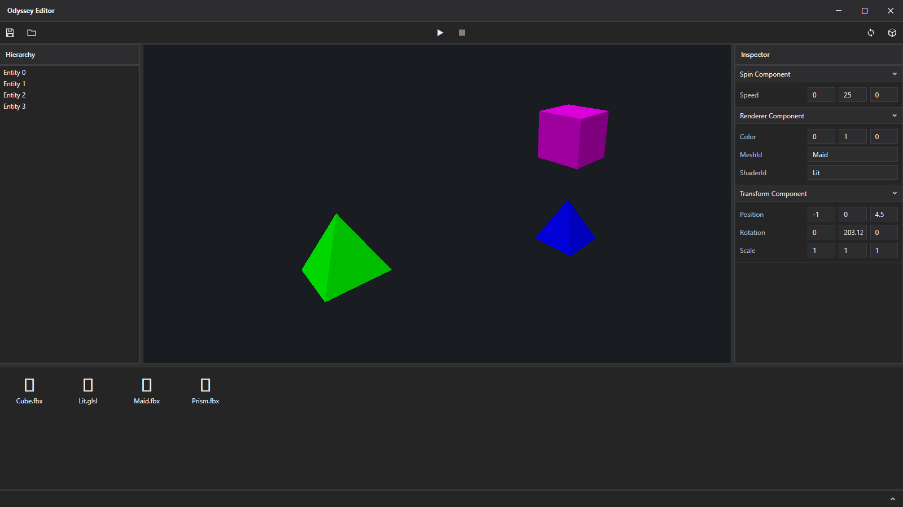

# Odyssey Engine

A custom 3D game engine in C++23 with a separate C#/WPF editor. The editor communicates with the engine over a local socket, allowing the engine to be restarted independently if it crashes without taking down the editor.

---

## Overview



### Engine (C++23)

A standalone runtime that owns the window, the renderer, and the world.

- **Rendering**
- **ECS**
- **Components & modules**
- **Reflection & serialization**
- **Resources**
- **Editor bridge**

### Editor (C#, .NET 10)

A native WPF desktop application built on a clean, layered architecture.

- **Domain / Application / UI**
- **MVVM**
- **Panels**
- **Services**
- **Engine connection**

### How the embedding works

When the workspace opens, the editor:

1. Launches the engine process headless (`-hide`) on a chosen port.
2. Sends a `get_viewport` request and receives the engine window's native handle (HWND).
3. Reparents that window into a WPF `HwndHost`, restyles it as a child window, and keeps it sized to the panel.

The result is a single editor window with the real, live C++ OpenGL viewport rendering inside it.

---

## Tech stack

| Area | Choice |
|------|--------|
| Engine language | C++23 |
| Graphics | OpenGL 4.6 core, GLAD, GLFW, GLM |
| Serialization | nlohmann/json |
| Engine build | CMake + Ninja, MSVC 2022 |
| Editor language | C# / .NET 10 |
| Editor UI | WPF, MVVM (CommunityToolkit.Mvvm) |
| DI / hosting | Microsoft.Extensions.Hosting |
| Engine ↔ editor | TCP, length-prefixed JSON (RPC + events) |
| Task runner | just |

---
## Prerequisites

> Windows-only - the editor uses WPF and native HWND reparenting, and the engine builds with MSVC.

- [Visual Studio 2022 Build Tools](https://visualstudio.microsoft.com/downloads/) (MSVC toolchain) - `winget install Microsoft.VisualStudio.2022.BuildTools`
- [Ninja](https://ninja-build.org/) - `winget install Ninja-build.Ninja`
- [just](https://github.com/casey/just) - `winget install Casey.Just`
- [.NET 10 SDK](https://dotnet.microsoft.com/download) (for the editor) - `winget install Microsoft.DotNet.SDK.10`
- [Python 3](https://www.python.org/) with `libclang` (for the reflection code generator) - `pip install libclang`

CMake fetches other packages automatically on first configure.

## Setup

Set the path to your `VsDevCmd.bat` in `justconfig.json`.

## Build & run

Build engine:

Create new project:

```sh
just new-project {parent_directory} {project_name}
```

Build project and run editor:

```sh
just build-and-run {parent_directory}/{project_name}
```

# Modify codebase

Open `{parent_directory}/{project_name}` in VS Code.

# Rebuild & release

There are buttons in the top right corner of the editor that allow rebuilding codebase and packaging project into usable output directory.
